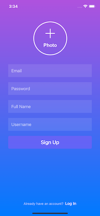
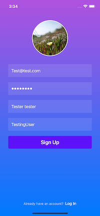
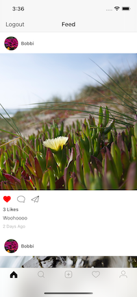
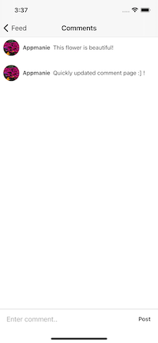
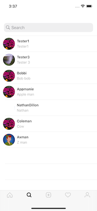
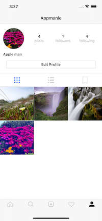
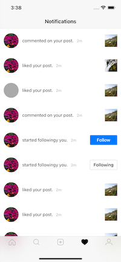
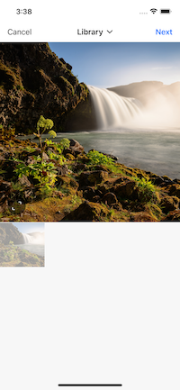
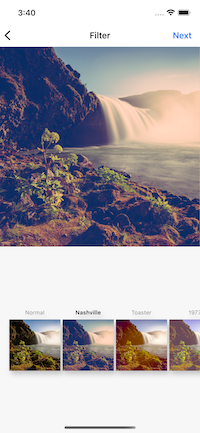

# Instagram Clone App 

All the core compoments of ready to be published Instagram features :

1. Create users
2. Create a user profile
3. Authenticate users with Firebase
4. Search for users
5. Upload posts
6. Home feed with posts from followers
7. Like posts
8. Comment on posts 
9. In app notifications for following, post likes and post comments
10. Follow/Unfollow users from profile
11. Follow/Unfollow user from notifications screen
12. Go to post or profile from notifications screen
13. Display timestamp on posts and notifications
14. Logging in and logging out

## More about the project :

* Advanced auto-layout and programmatic UI with Swift
* Modified MVVM Architecture
* Backend using Cloud Firestore
* Register and authenticate users using FirebaseAuth
* Advanced Object Oriented Programming skills
* Used CocoaPods : Firebase, ActiveLabel, SDWebImage, JGProgressHUD, YPImagePicker

